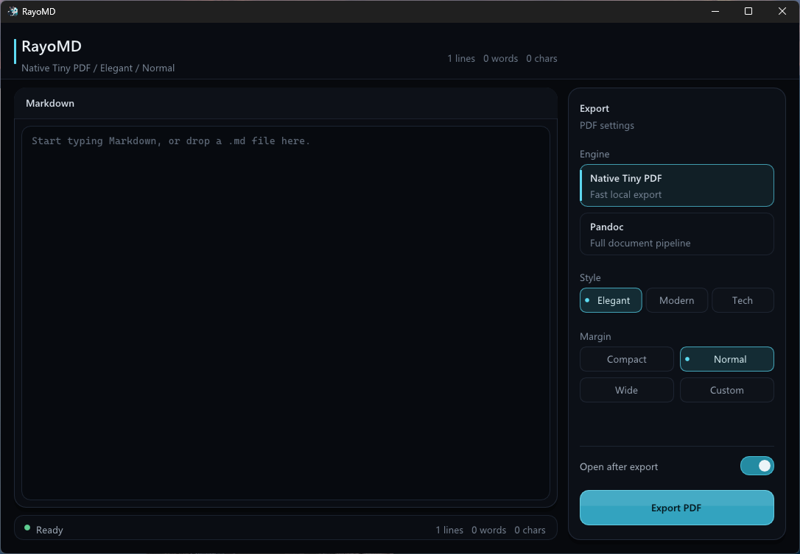

# RayoMD

<p align="center">
  <a href="https://github.com/Butterski/md2pdf/actions/workflows/ci.yml"></a>
  <a href="https://github.com/Butterski/md2pdf/actions/workflows/hygiene.yml"></a>
  <a href="https://github.com/Butterski/md2pdf/actions/workflows/release.yml"></a>
  <a href="https://github.com/Butterski/md2pdf/actions/workflows/codeql.yml"></a>
  
  
  
  
</p>

RayoMD is a tiny native Markdown-to-PDF converter built for fast startup,
small releases, and predictable deployment.

<p align="center">
  
</p>

<p align="center">
  
</p>

<p align="center">
  
</p>

<p align="center">
  <a href="docs/show.mp4">Download the MP4 demo</a>
</p>

The default renderer parses Markdown and writes PDF bytes directly from C++17.
It does not start a browser, bundle a runtime, or require Pandoc or LaTeX on
the fast path. Windows builds a compact Dear ImGui + DirectX 11 desktop app
with CLI modes; non-Windows builds use the same native exporter through a small
CLI.

## Highlights

- Native Markdown-to-PDF path with no browser engine.
- Single Windows GUI executable for the default release.
- Compact non-Windows CLI binary.
- Fast warm conversion for small and medium documents.
- Batch, stdin Markdown export, stdin batch, warm serve, and benchmark modes.
- Unicode output through subset embedded system fonts.
- Standard PDF font path for ASCII documents.
- Safe local image support with fallback text; HTTP/HTTPS images are explicit opt-in on Windows and curl-enabled Linux builds.
- Clickable Markdown links emitted as PDF annotations.
- Optional Windows Pandoc mode for full-document compatibility.

Pandoc mode resolves `pandoc.exe` to an executable path before launch. During the transition it may still resolve from `PATH`, but it warns when `RAYOMD_PANDOC` is not set to an absolute executable path.

## When To Use It

Use native RayoMD when the document is simple, speed matters, and the
package needs to stay small. Use Pandoc, a browser renderer, or LaTeX when you
need a complete document ecosystem.

| Need | Native RayoMD | Pandoc / browser / LaTeX |
|---|---|---|
| Small release artifact | Good fit | Usually much larger |
| Cold startup speed | Good fit | Often slower |
| Bulk conversion | Very Good fit | Depends on external tool startup |
| Full CommonMark/Pandoc extensions | Not a goal | Good fit |
| Full TeX math layout | Not supported | Good fit |
| Custom templates and filters | Not supported | Good fit |
| Simple Markdown reports | Good fit | Also works, with more dependencies |

The native renderer is intentionally a fast Markdown subset, not a Pandoc clone.
That boundary keeps the binary small and the default path dependency-light.

## Benchmark Snapshot

These are local CMake Release results kept as reproducible baselines for this
repository. Treat them as engineering numbers, not universal performance claims:
hardware, storage, fonts, compiler, and document shape all matter. The small
document smoke rows were refreshed on 2026-06-18 after making the remote image
in `tester.md` deterministic. The Linux `tester.md` row was refreshed on
2026-06-21 for the default no-curl Linux build.

Warm `--bench` rows measure in-process PDF byte generation after startup. Export
and batch rows include process and file I/O. Linux small-document rows below
were run from a Windows-mounted WSL path (`/mnt/e`); Linux batch numbers in the
larger synthetic table came from native WSL ext4 storage. `/mnt/*`
Windows-mounted paths are much slower for many small files.

### Small Document Smoke

The `tester.md` rows use `modern normal`; the ASCII smoke row uses the verifier
default shown in `scripts/verify-linux.sh`. PDF byte counts can differ by
platform because native builds use platform font and optional image pipelines.

| Build | Input | Iterations | Avg conversion | Output PDF |
|---|---:|---:|---:|---:|
| Windows GUI/CLI | `tester.md`, Unicode | 100 | `1.26 ms` | `730,223 bytes` |
| Linux CLI | `tester.md`, Unicode | 100 | `5.03 ms` | `878,079 bytes` |
| Linux CLI | ASCII smoke doc | 1,000 | `0.02 ms` | `1,885 bytes` |

Release binary sizes from local release builds:

| Target | Size |
|---|---:|
| `rayomd.exe` Windows app | `2,364,928 bytes` |
| `rayomd` Linux CLI | `276,912 bytes` |

Example output from `tester.md` is tracked as
[`docs/tester.pdf`](docs/tester.pdf) for quick release-page previews.

### Local Pandoc Comparison

On 2026-06-18, a local Windows end-to-end export comparison against
Pandoc 3.9.0.1 + XeLaTeX showed the native RayoMD path about `182x` to `322x`
faster on simple synthetic Markdown cases covering a 500-row table, nested lists
with code, and a mixed 100 KiB report.

| Case | RayoMD median | Pandoc median |
|---|---:|---:|
| 500-row pipe table | `38.98 ms` | `7113.89 ms` |
| Nested lists and code | `20.21 ms` | `6504.84 ms` |
| Mixed 100 KiB report | `52.45 ms` | `10614.53 ms` |

This compares a narrow native Markdown subset with a much more complete Pandoc
document pipeline, so it is a scope comparison as much as a speed comparison.
See [`docs/benchmarks/pandoc_comparison_2026-06-18.md`](docs/benchmarks/pandoc_comparison_2026-06-18.md)
for methodology and caveats.

### Larger Synthetic Runs

Run date: 2026-06-06. Full caveats and source report pointers are in
[`docs/benchmarks/commercial_benchmark_summary.md`](docs/benchmarks/commercial_benchmark_summary.md).

| Case | Result | Caveat |
|---|---:|---|
| Linux 100 MB native export | `7.03 s` | WSL ext4, synthetic ASCII-heavy document |
| Windows 100 MB native export | `13.48 s` | Synthetic ASCII-heavy document |
| Linux 100 MB warm native benchmark | `6.48 s avg` | Warm `--bench`, no end-to-end I/O |
| Linux 100-file stdin batch | `0.144 s` | 100 synthetic files around 20 KB each |
| Windows 20-file batch | `0.610 s` | 20 synthetic files around 100 KB each |
| Windows Pandoc compatibility smoke | `8.11 s` | External Pandoc/LaTeX path, 100 KB ASCII input |

Use `scripts/perf_watch.py` for current before/after work. It records machine
and git metadata, keeps JSONL history, and compares matching runs.

## Native Markdown Support

| Feature | Native support |
|---|---|
| Headings and paragraphs | Yes |
| Bullet and numbered lists | Yes, including simple indentation-based nesting |
| Block quotes | Yes |
| Fenced code blocks | Yes, plain rendering without syntax highlighting |
| Pipe tables | Yes, with basic left, center, and right alignment |
| Horizontal rules | Yes |
| Explicit page breaks | `\pagebreak`, `\newpage`, and `<!-- pagebreak -->` |
| Inline emphasis | Cleanup/rendering for bold, italic, strikethrough, and code spans |
| Links | Clickable PDF annotations for Markdown links |
| Images | Standalone local images contained to the Markdown file directory by default; HTTP/HTTPS images with explicit opt-in on Windows and curl-enabled Linux builds; alt-text fallback |
| Math markers | Inline cleanup and `$$` blocks rendered as formula boxes |
| Unicode | Embedded subset system font when needed |
| YAML front matter | Ignored |
| Common status emoji | Normalized fallback text for supported symbols |

Native mode does not currently support:

- Full CommonMark or Pandoc extension compatibility.
- Full TeX math layout.
- Syntax highlighting.
- Footnotes.
- Citations and bibliographies.
- Custom Pandoc filters or templates.
- HTML/CSS layout fidelity.

## Build

### Windows

Requirements:

- MinGW-w64 with C++17 support.
- Windows SDK / DirectX 11 libraries.
- CMake.

Build:

```sh
cmake -S . -B build/windows -G "MinGW Makefiles" -DCMAKE_BUILD_TYPE=Release
cmake --build build/windows --config Release
```

Output:

```text
build/windows/rayomd.exe
```

### Linux / WSL

Requirements:

- `g++` or `clang++` with C++17 support.
- CMake.
- A system TrueType font for Unicode output, such as DejaVu Sans.
- zlib development headers are optional and enable PNG alpha support when found.
- libcurl development headers are optional and enable HTTP/HTTPS image fetching when `RAYOMD_USE_CURL=ON`.

Ubuntu/WSL dependencies:

```sh
sudo apt-get update
sudo apt-get install -y g++ cmake fonts-dejavu-core zlib1g-dev
```

Build:

```sh
cmake -S . -B build/linux -DCMAKE_BUILD_TYPE=Release
cmake --build build/linux --config Release
```

This default Linux build does not link libcurl, avoiding distro-specific
`libcurl.so.4` symbol-version requirements in portable binaries. HTTP/HTTPS
images degrade to fallback text in that build. To enable Linux URL image
fetching, install libcurl development headers and configure with:

```sh
cmake -S . -B build/linux-curl -DCMAKE_BUILD_TYPE=Release -DRAYOMD_USE_CURL=ON
cmake --build build/linux-curl --config Release
```

Output:

```text
build/linux/rayomd
```

Linux verification:

```sh
sh scripts/verify-linux.sh
```

## Continuous Verification

GitHub Actions run the release-critical checks on every push and pull request:

| Workflow | What it verifies |
|---|---|
| `CI` | Linux native CLI build/export/bench, Windows MinGW ImGui build, and a Windows benchmark smoke |
| `Repository Hygiene` | Required release files, Python helper syntax, local README targets, and no generated binaries/PDFs in source |
| `Release` | Tag/manual release packaging for Windows, default Linux, and curl-enabled Linux assets |
| `CodeQL` | Weekly and PR C++ static analysis for the Linux native build path |

## Usage

### Windows GUI

1. Run `rayomd.exe`.
2. Write or paste Markdown, or drag in a `.md` file.
3. Choose `Native Tiny PDF` or `Pandoc (full)`.
4. Choose style and margin.
5. Export with the button or `Ctrl+E`.
6. Enable `URL images` only for documents that should fetch remote images.

### CLI

Only the input and output paths are required for `--export`; use
`--stdin <output.pdf>` when piping Markdown content from another program.
Engine, style, and margin default to `native`, `elegant`, and `normal`. Local
images are contained to the input Markdown file directory by default, and URL
images are disabled unless `--allow-url-images` is passed or the Windows GUI
checkbox is enabled. Stdin exports have no input-file directory, so relative
local images render as fallback text unless `--allow-unsafe-local-images` is
explicitly used for trusted content.

Windows:

```batch
rayomd.exe --version
rayomd.exe --export input.md output.pdf native elegant normal
type input.md | rayomd.exe --stdin output.pdf native elegant normal
rayomd.exe --batch input-folder output-folder native modern normal
type files.txt | rayomd.exe --stdin-batch output-folder native modern normal
rayomd.exe --serve output-folder native modern normal
rayomd.exe --bench input.md bench-output-folder 5000 modern normal
```

Linux / WSL:

```sh
./rayomd --version
./rayomd --export input.md output.pdf native elegant normal
cat input.md | ./rayomd --stdin output.pdf native elegant normal
./rayomd --batch input-folder output-folder native modern normal
cat files.txt | ./rayomd --stdin-batch output-folder native modern normal
./rayomd --serve output-folder native modern normal
./rayomd --bench input.md bench-output-folder 5000 modern normal
```

Modes:

| Mode | Use case |
|---|---|
| `--version` | Print the compiled project version |
| `--export` | Convert one Markdown file |
| `--stdin` | Convert Markdown content read from stdin into one PDF |
| `--batch` | Convert every `.md` file in a folder |
| `--stdin-batch` | Feed Markdown file paths from another process |
| `--serve` | Keep one process warm and convert paths sent over stdin |
| `--bench` | Measure native PDF generation time and output size |

Styles:

- `elegant`
- `modern`
- `tech`

Resource flags:

- `--allow-url-images` enables HTTP/HTTPS image fetching and still blocks loopback, private, link-local, multicast, and non-HTTP(S) redirect targets.
- `--allow-unsafe-local-images` restores legacy local-image path behavior for trusted documents only.

Margins:

- `compact`
- `normal`
- `wide`
- `margin=0.75in`
- `margin=54pt`

Exit codes:

| Code | Meaning |
|---:|---|
| `0` | Success |
| `2` | Missing or invalid CLI arguments |
| `3` | Input file or stdin Markdown could not be read |
| `11` | Native exporter could not load a system font |
| `12` | Native exporter could not write the PDF |
| `20` | Pandoc export failed or is unsupported in this build |

## C++ API

The public native API is intentionally small and lives in
[`include/rayomd/tiny_pdf.h`](include/rayomd/tiny_pdf.h).

```cpp
#include "rayomd/tiny_pdf.h"

#include <string>

std::string pdfBytes;

TinyPdf::BuildOptions options;
options.styleIdx = 1;      // modern
options.marginIdx = 1;     // normal
options.sourcePath = "input.md";
options.enableUrlImages = false;  // set true only for trusted URL image fetches

if (!TinyPdf::BuildPdfBytes(markdownText, options, pdfBytes)) {
    return TinyPdf::g_lastError;
}
```

Set `BuildOptions::sourcePath` for file-based conversions so relative local
images resolve next to the input Markdown file. By default, local image targets
must remain inside that source directory after canonicalization. Set
`allowUnsafeLocalImages` only for trusted documents that deliberately need
absolute, UNC/device, or parent-escaping paths.

## Performance Watcher

Use `scripts/perf_watch.py` when you want a repeatable "did this version get
slower?" check. It creates a deterministic random Markdown corpus using the
native feature subset, runs no-UI CLI modes, appends a JSONL history record, and
reports percent deltas against the previous matching platform/suite/seed/options
run.

Windows:

```sh
python scripts/perf_watch.py --binary build/windows/rayomd.exe --platform windows --suite watch --label local
```

Compare end-to-end native export against Pandoc when Pandoc and XeLaTeX are
available:

```sh
python scripts/compare_pandoc.py --rayomd build/windows/rayomd.exe --root benchmark-output/pandoc-comparison-windows --runs 5
```

WSL/Linux:

```sh
python3 scripts/perf_watch.py --binary build/linux/rayomd --platform linux-wsl --suite watch --label local
```

Run both from PowerShell when both binaries are already built:

```powershell
scripts/perf_watch_both.ps1 -Suite watch -Label local
```

Suites are `quick`, `watch`, and `full`. Add `--fail-on-slower-pct 10` when the
watcher should return a nonzero exit code if any time metric is at least 10%
slower than the previous matching run. Remote image timing is intentionally
excluded because network timing is not a stable performance signal.

## Project Layout

```text
include/rayomd/       Public C++ header for the native exporter
src/core/                    Portable Markdown parser and PDF writer
src/cli/                     Portable CLI entry point
src/win32/                   Windows Dear ImGui app, CLI glue, and resources
scripts/                     Verification and benchmark helper scripts
docs/assets/                 Mascot and icon source assets
docs/ui.png                  Windows app screenshot
docs/show.gif                Windows app demo animation
docs/show.mp4                Windows app demo video
docs/benchmarks/             Archived benchmark summaries and caveats
docs/optimization/           Optimization notes and research follow-up
third_party/imgui/           Vendored Dear ImGui v1.92.8
third_party/simdutf/         Optional simdutf experiment, OFF by default
scripts/compare_pandoc.py    Local RayoMD vs Pandoc comparison helper
tester.md                    Hand-written smoke/regression Markdown document
CMakeLists.txt               Cross-platform build definition
```

Generated build trees, benchmark corpora, local binaries, and generated PDFs
other than the intentional [`docs/tester.pdf`](docs/tester.pdf) sample are
ignored and should not be committed.

## Packaging

Default native releases are intentionally small:

- Windows GUI release: ship `rayomd-<version>-windows-x64.zip` with `rayomd.exe`.
- Linux/WSL CLI release: ship `rayomd-<version>-linux-x64.tar.gz` with the default no-curl `rayomd`.
- Linux curl edition: ship `rayomd-<version>-linux-x64-curl.tar.gz` with URL image fetching enabled through libcurl.

The release workflow publishes these assets when `VERSION` changes on `master`/`main`,
for `v<VERSION>` tags, or from a manual workflow run. Manual reruns replace the
release files in place.

Do not bundle Pandoc unless deliberately producing a larger compatibility
package and accounting for Pandoc's GPL license terms. Keep the native package
dependency-light.

The project license allows commercial use, paid binaries, paid support, and a
hosted API service. It does not stop someone else from building a competing
commercial product from the open-source code. Use a separate commercial license,
cloud terms of service, trademark policy, or source-available license only if
that becomes a business requirement.

## Development Notes

- Read [`AGENTS.md`](AGENTS.md) before making changes.
- See [`CONTRIBUTING.md`](CONTRIBUTING.md) for build, verification, and release
  contribution notes.
- Keep benchmark claims conservative and reproducible.
- Keep the native renderer honest about being a subset.
- Prefer standard library and platform APIs already in use before adding
  dependencies.
- Do not edit vendored Dear ImGui files unless the task explicitly requires it.

## License

RayoMD is released under the Apache License 2.0. See [`LICENSE`](LICENSE)
and [`NOTICE`](NOTICE). Dear ImGui keeps its own license in
[`third_party/imgui/LICENSE.txt`](third_party/imgui/LICENSE.txt).
